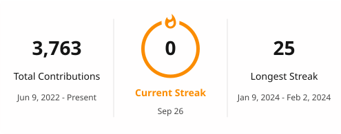

# Contributions
<picture>
  <source media="(prefers-color-scheme: dark)" srcset="https://raw.githubusercontent.com/YapWH1208/YapWH1208/output/github-contribution-grid-snake-dark.svg">
  <source media="(prefers-color-scheme: light)" srcset="https://raw.githubusercontent.com/YapWH1208/YapWH1208/output/github-contribution-grid-snake.svg">
  
</picture>

<!--
# 🌐 Socials:

-->

# 💻 Tech Stack:

 

 

 

# 📊 GitHub Stats

  
  

    

  

